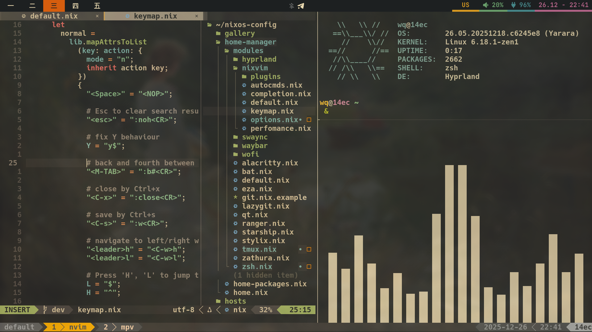
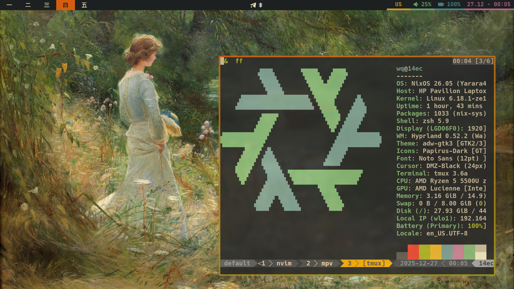

# ❄️ NixOS Configuration using Flakes

[](#)
[](#)
[](#)


Welcome to redesigned by me [Ampersand's](https://www.youtube.com/@ampersand3636) NixOS configuration with unstable channel.

## 🖥️ Quick overview

- ❄️ **[Flakes](https://wiki.nixos.org/wiki/Flakes)**: Configured NixOS flakes for maximum reproducibility.
- 🏠 **[Home Manager Integration](https://nix-community.github.io/home-manager/)**: Configured for managing the home environment.
- 🎨 **[Gruvbox Material Theme](https://github.com/sainnhe/gruvbox-material)**: A perfect blend of vibrant and subtle colors.
- 💧 **[Hyprland](https://hypr.land)**: Highly customizable tiling Wayland compositor.
- 💧 **[Hyprscrolling](https://github.com/hyprwm/hyprland-plugins/tree/main/hyprscrolling)**: Plugin for Hyprland which adds a scrolling layout.
- 📊 **[Waybar](https://github.com/Alexays/Waybar):** A highly customizable Wayland bar.
- 📨 **[Swaync](https://github.com/ErikReider/SwayNotificationCenter):** A notification daemon for Wayland, themed with Gruvbox.
- 🔒 **[Hyprlock](https://hyprland.org/docs/ecosystem/hyprlock/):** The native screen locker for Hyprland, showing a blurred background and the current time.
- 🚄 **[Alacritty](https://alacritty.org/):** A blazing fast and GPU-accelerated terminal emulator.
- 🌟 **[Zsh](https://wiki.archlinux.org/title/Zsh)**: Efficient shell setup with lots of aliases.
- 🧇 **[Tmux](https://github.com/tmux/tmux/wiki)**: Terminal multiplexer with convenient hotkeys.
- ⌨️ **[Neovim](https://neovim.io)**: Vim-fork focused on extensibility configured using Nixvim.
- 🦆 **[Yazi](https://yazi-rs.github.io/):** Blazing fast terminal file manager written in Rust, based on async I/O.
- 📖 **[Zathura](https://pwmt.org/projects/zathura/):** A highly customizable document viewer with VI-like keybindings.
- 🛑 **[Zapret](https://https://github.com/bol-van/zapret):** Multi platform DPI bypass service.

## 🚀 Installation

To get started with this setup, follow these steps:

1. **Install NixOS**: If you haven't already installed NixOS, follow the [NixOS Installation Guide](https://nixos.org/manual/nixos/stable/#sec-installation) for detailed instructions.
2. **Clone the Repository**:

	```bash
    https://github.com/wqqzxts/nixos-config.git
    cd nixos-config
    ```

3. **Copy the hosts configuration to set up your own**:

    ```bash
    cd hosts
    cp -r 14ec <your_hostname>
    cd <your_hostname>
    ```

4. **Put *your* `hardware-configuration.nix` file there**:

    ```bash
    cp /etc/nixos/hardware-configuration.nix ./
    ```

5. **Edit `nixos/modules/timezone.nix.example`, `home-manager/modules/git.nix.example`**:

    ```diff
    // do not forget to change the name of timezone file (delete .example)
    {
    --  time.timeZone = "Europe/London";
    ++  time.timeZone = "<YourContinent>/<YourCity>";
    }
    ```

    ```diff
    // do not forget to change the name of git file (delete .example)
    user = {
    --  name = "John Doe";
    ++  name = "YourName";
    --  email = "johndoe@example.com";
    ++  email = "youremail@example.com";
    };
    ```

6. **(optional) edit `nixos/modules/zapret.nix.example` (if you have own strategy) and enable service in `nixos/modules/default.nix`**:
    ```diff
    // do not forget to change the name of zapret file (delete .example)
    imports = [
    --  # ./zapret.nix
    ++  ./zapret.nix
  ];

7. **Edit other `hosts/<your_hostname>/local-packages.nix` and `nixos/modules/` files if needed (if you think of packages bloat)**:

    ```bash
    nano local-packages.nix
    nano ../../nixos/modules/filename.nix
    ```

8. **Finally, edit the `flake.nix` file**:

    ```diff
      outputs = { self, nixpkgs, home-manager, ... }@inputs: let
        system = "x86_64-linux";
    --  homeStateVersion = "25.11";
    ++  homeStateVersion = "<your_home_manager_state_version>";
    --  user = "wq";
    ++  user = "<your_username>";
        hosts = [
    --    { hostname = "14ec"; stateVersion = "25.11"; }
    ++    { hostname = "<your_hostname>"; stateVersion = "<your_state_version>"; }
        ];
    ```

9. **Build system**:

    ```bash
    cd nixos-config
    nixos-rebuild switch --flake path:./#<hostname>
    # or nixos-install --flake path:./#<hostname> if you are installing on a fresh system
    home-manager switch --flake path:.
    ```

## 😎 Enjoy!



## 🤝 Contributions

Feel free to fork the repository and submit pull requests if you'd like to contribute improvements. Open issues if you encounter any problems with the config or have ideas for new features. Special thanks to [Ampersand's](https://www.youtube.com/@ampersand3636) as he provided NixOS config.
